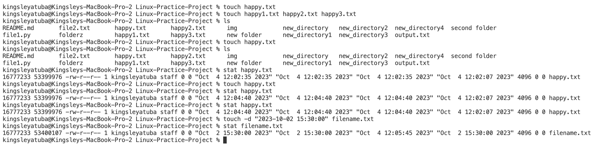
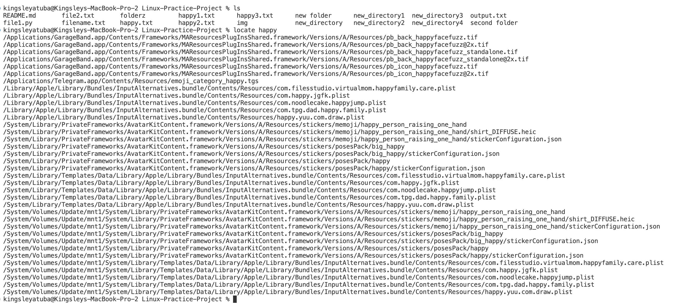
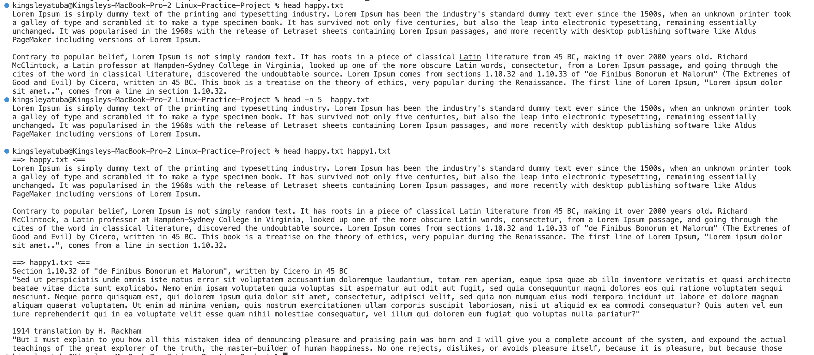
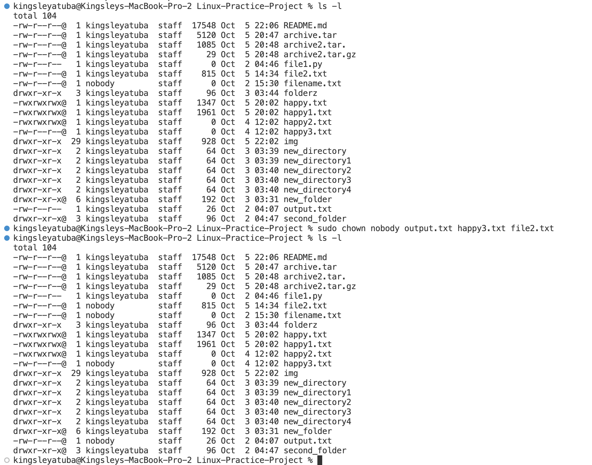

# Introduction to linux
Linux is an open-source, Unix-like operating system kernel that serves as the core component of various Linux distributions. It provides a stable and customizable platform for running computer systems, from servers and desktops to embedded devices.

## What is Linux Command
Linux commands are text-based instructions that allow users to interact with the Linux operating system. They are used to perform tasks such as file manipulation, system administration, and program execution, providing a powerful and flexible way to manage and control Linux systems. All linux commands are case sensitive.

An example of linux command is `ls`
The "ls" command is used to list the files and directories in the current directory, providing a basic overview of the contents of the folder you are in.

## File Manipulation
### The `sudo` Command
The "sudo" command in Linux is used to execute a command with superuser privileges or as another user, typically the root user. It is often used to perform administrative tasks that require elevated permissions. If you want to update the package list on a Debian-based system using the "apt" package manager, you can use "sudo" like this: `sudo apt update`

You will be prompted to enter your password to confirm your identity before the command is executed with superuser privileges. This helps enhance system security by restricting elevated access only to authorized users.

### The `pwd` Command
The pwd command in Linux stands for "print working directory." When you run this command, it displays the current directory or folder you are in within the Linux file system. This can be useful to determine your current location in the directory structure. Here's how you use it: `pwd`

Upon running this command, it will provide the full path to the current directory, helping you understand your file system context.

### The `cd` Command
The cd command in Linux stands for "change directory." It is used to navigate through the directory structure of the Linux file system by changing your current working directory. You specify the directory you want to move to as an argument to the cd command

* `cd /path/to/directory`       #move to a specific directory:
* `cd ~`                        #move to your home directory
* `cd ..`                       #move up one directory (to the parent directory)
* `cd - `                       #move to the previous directory you were in (if you've recently changed directories)

The cd command is a fundamental tool for navigating and working with files and directories in the Linux command line. 

### The `ls` Command 
The ls command in Linux is used to list the files and directories in the current directory or a specified directory. It provides a basic overview of the contents of a folder.

* `ls`                          #List files and directories in the current directory
* `ls /path/to/directory`       #List files and directories in a specific directory
* `ls -l`                       #List files and directories with additional information
* `ls -la`                      #List files and directories in a long format, including hidden files
* `ls -lh`                      #List files and directories in a human-readable format

### The `echo` Command

The echo command in Linux is used to print text or messages to the terminal or standard output. It is often used in shell scripts or command-line operations to display information or create simple outputs.

* `echo "Hello, World!"`                                  #Display a message or text on the terminal
* `variable="Value"`, `echo $variable`                    #Print the value of a variable
* `echo "Some text" > output.txt`                         #Redirect the output of echo to a file
* `echo "Additional text" >> existingfile.txt`            #Append text to an existing file
* `echo "The current date is $(date)"`                    #Display the result of a command or command substitution

### The `cat` Command
The cat command in Linux is used to display the contents of one or more text files on the terminal. 

* `cat filename.txt`                              #Display the contents of a single file
* `cat file1.txt file2.txt`                       #Concatenate and display the contents of multiple files
* `cat -n filename.txt`                           #Display the contents of a file with line numbers
* `cat file1.txt file2.txt > combined.txt`        #Create a new file or overwrite an existing file by combining the contents of multiple files
* `cat file1.txt file2.txt >> existingfile.txt`   #Append the contents of one or more files to an existing file

### The `mv` Command
The mv command in Linux is used to move or rename files and directories. It allows you to change the location of a file or directory within the file system or simply rename it. 

* `mv sourcefile.txt destination/`            #Move a file to another location
* `mv oldname.txt newname.txt`                #Rename a file
* `mv sourcedirectory/ destination/`          #Move a directory and its contents to another location 
* `mv oldname/ newname/`                      #Rename a directory
* `mv file1.txt file2.txt destination/`       #Move multiple files into a directory
* `mv -f sourcefile.txt destination/`         #Forcefully overwrite an existing file at the destination

### The `cp` Command
The cp command in Linux is used to copy files and directories from one location to another. It allows you to duplicate files and directories while preserving their attributes and content.

* `cp sourcefile.txt destination/`            #Copy a file to another location
* `cp file1.txt file2.txt destination/`       #Copy multiple files to a directory
* `cp -r sourcedirectory/ destination/`       #Copy a directory and its contents recursively to another location
* `cp -a sourcefile.txt destination/`         #Preserve file attributes (such as permissions, timestamps, and ownership) when copying
* `cp -i sourcefile.txt destination/`         #Prompt for confirmation before overwriting an existing file
* `cp -s sourcefile.txt symlinkname`          #Create a symbolic link (symlink) to a file or directory instead of copying its contents

### The `mkdir` Command
The mkdir command in Linux is used to create new directories or folders within the file system. It allows you to organize and structure your files and data by creating directories to contain them.

* `mkdir new_directory`                       #Create a new directory in the current location
* `mkdir /path/to/new_directory`              #Create a new directory with a specified path
* `mkdir dir1 dir2 dir3`                      #Create multiple directories with a single command
* `mkdir -p /path/to/nested/directory`        #Create parent directories along with a new directory if they don't already exist
* `mkdir -m 755 new_directory`                #Create directories with specific permissions (e.g., read, write, and execute permissions)

### The `touch` Command
The touch command in Linux is used to create new empty files or update the access and modification timestamps of existing files. Here are some common usages of the touch command:

* `touch filename.txt`                                  #Create a new empty file
* `touch file1.txt file2.txt file3.txt`                 #Create multiple empty files with a single command
* `touch existingfile.txt`                              #Update the access and modification timestamps of an existing file
* `touch -d "2023-10-02 15:30:00" filename.txt`         #Create a new file with a specific timestamp

### The `locate` Command
The locate command in Linux is used to quickly locate files and directories on your system based on a pre-built database of file names and paths. It provides a fast way to search for files without the need to traverse the entire file system.

* `locate example`                                       #to find all files with the word "example" in their name or path
* `locate -i school*note`                                #to search for files that contain the words school and note, whether they use uppercase or lowercase

### The `grep` Command
The grep command in Linux is a powerful tool used for searching and pattern matching within text files or the output of other commands. It allows you to find and display lines in files or text streams that match a specified pattern or regular expression. 

* `grep "search_string" filename.txt`                    #Search for a specific string in a file
* `grep "search_string" file1.txt file2.txt`             #Search for a string in multiple files
* `grep -i "pattern" filename.txte`                      #Perform a case-insensitive search
* `grep -n "pattern" filename.txt`                       #Display line numbers with matching lines
* `grep -r "pattern" /path/to/directory/`                #Search recursively in directories and subdirectories
* `grep "^start.*end$" filename.txt`                     #Use regular expressions for more complex pattern matching

### The `find` Command
The find command in Linux is a powerful tool for searching and locating files and directories within a file system. It allows you to search for files and directories based on various criteria, including their names, types, sizes, and modification times.

* `find . -name filename.txt`                              #Find a file by name in the current directory and its subdirectories
* `find /path/to/search -type f -name "*.pdf"`             #Search for files by a specific type (e.g., find all PDF files)
* `find /path/to/search -type d -name "dirname"`           #Find directories by name
* `find /path/to/search -type f -size +10M`                #Search for files by size (e.g., find all files larger than 10MB)

### The `which` Command
The which command in Linux is used to locate and display the full path of an executable program or script in your system's directories. It helps you identify the location of a specific command that you intend to run

* `which command_name`                                     #basic syntax of the which command
* `which ls`                                               #to find the location of the ls command

### The `df` Command
The df command in Linux is used to display information about disk space usage on mounted file systems. It provides details about the total disk space, used space, available space, and other relevant information for each mounted file system.

* `df [options] [filesystem...]`                        #basic syntax of the df command
* `df`                                                  #Display disk space usage for all mounted file systems
* `df -h`                                               #Display disk space usage in a human-readable forma
* `df /path/to/directory`                               #Show disk space usage for a specific file system or directory

### The `du` Command
The du (disk usage) command in Linux is used to estimate and display the disk space usage of files and directories. 
It provides information about the size of files and directories, helping you identify which parts of your file system consume the most storage space.

* `du /path/to/directory`                                   #Display the disk space usage of a specific directory
* `du [-shx][directory or file path]`                       #basic syntax of du command
* `du -s .`                                                 #total disk space used in current directory
* `du -hs * | sort -rh | head -50`                          #sort and display top 50 largest folders in MB
* `du -sh /path/to/directory`                               #Display the total disk space usage for a directory and its subdirectories

### The `head` Command
The head command in Linux is used to display the beginning (the "head") of a text file or the output of a command. By default, it shows the first 10 lines of a file or the first 10 lines of the output from a command

* `head [options...] [file ...]`                         #display first few lines from each FILE to standard output
* `head filename`                                        #display first few lines from text files (default is ten, can be changed with `-n`)
* `head -n 5 filename.txt`                               #Display a specific number of lines (e.g., 5 lines) from the beginning of a file
* `head file1.txt file2.txt`                             #Display the first few lines of multiple files

### The `tail` Command
The tail command in Linux is used to display the end (the "tail") of a text file or the output of a command. By default, it shows the last 10 lines of a file or the last 10 lines of the output from a command

* `tail filename`                                         #display last n number of line from given textfile, default is ten
* `tail file1.txt file2.txt`                              #Display last few lines of multiple files

### The `diff` Command
The diff command in Linux is used to compare the contents of two text files line by line and display the differences between them. It is a useful tool for identifying changes, additions, and deletions in files, making it valuable for tracking changes in code, configuration files, or any text-based documents.

* `diff file1.txt file2.txt`                            #Compare two text files line by line, showing changes between them
* `diff -y file1.txt file2.txt`                         #Generate a side-by-side comparison of the differences
* `diff -u file1.txt file2.txt`                         #Generate a unified (context) diff for easier readability
* `diff -b file1.txt file2.txt`                         #Ignore leading and trailing white space differences

### The `tar` Command
The tar command in Linux is used for archiving and compressing files and directories into a single file. The term "tar" stands for "tape archive," but it is commonly used to create archive files regardless of whether they are intended for tape storage. The tar command can also be used to extract files from archive files.
* `tar [options] <source> [<destination>]`                          #Create an archive from source (file, folder etc.)
* `tar -cvf archive_name.tar directory_to_be_archived`              #Create an archive named 'archive_name.tar
* `tar [options] -xvf archive_name.tar`                             #extract files from a tar archive
* `tar -cvf archive.tar file_or_directory`                          #Create a tar archive of a single file or directory
* `tar -czvf archive.tar.gz file_or_directory`                      #Create a tar archive while displaying the progress

## File Permission and Ownership

### The `chmod` Command
The chmod command in Linux is used to change the permissions (mode) of files and directories. 
It allows you to control who can read, write, and execute files or directories. 
The chmod command is often used with symbolic or octal notation to specify permission settings.

* `chmod [options] permissions file(s)`                 #basic syntax of the chmod command
* `chmod 777 happy.txt happy1.txt happy2.txt`           #set permissions of both files to full read, write, and execute access for the owner, group, and others

### The `chown` Command
The chown command in Linux is used to change the ownership of files and directories. 
It allows you to change the user (owner) and group ownership of one or more files or directories. 
The chown command is useful for system administrators to manage file and directory ownership on a Linux system

* `chown new_owner filename`                            #Change the owner of a file or directory
* `chown new_owner:new_group filename`                  #Change the owner and group of a file or directory
* `chown :new_group filename`                           #Change only the group ownership of a file or directory
* `chown new_owner file1 file2 directory1 directory2`   #Change the owner of multiple files or directories at once

### The `jobs` Command
The jobs command in Linux is used to list the background jobs associated with the current shell session. 
When you run commands in the background (by appending & to the command), they become background jobs, 
allowing you to continue working in the same terminal session while the job runs in the background.

### The `kill` Command 
Terminates processes or sends signals to running processes, allowing users to control and manage processes on a Linux system. It is commonly used to stop misbehaving applications, gracefully shut down services, and control various aspects of process management.

* `kill [signal] PID`                               #terminate a process by its PID
* `ps aux | grep firefox, kill PID`                 #Find the PID of the process you want to terminate and kill it

### The `ping` Command
A network utility that sends ICMP Echo Request messages to a host or IP address to check its availability and measure the round-trip time for packets to travel to and from the destination. It is commonly used to diagnose network connectivity issues and determine the responsiveness of remote hosts or websites.
* `ping host`                                           #Check if a host is reachable
* `ping google.com`                                     #Connect to Google and measure its response time

### The `wget` Command
The wget command in Linux is used to download files from the internet. It is a powerful and versatile tool for fetching files, and it supports various protocols such as HTTP, HTTPS, FTP, and more.
* `wget url-name -O outputfile`                         #Download a web page from internet into an HTML document named "outputfile"
* `wget http://www.example.org/`                        #Download an entire web page from the specified URL using wget
* `wget https://wordpress.org/latest.zip`               #Download the latest version of Wordpress

### The `uname` Command
This command prints system information. It's commonly used for troubleshooting, as it provides details about the running kernel that may help identify software issues

* `uname`                                               #displays the operating system name
* `uname -a`                                            #provides a detailed output that includes information about the kernel
* `uname -s`                                            #display the kernel name
* `uname -n`                                            #display the network node hostname. It provides the hostname of the system

### The `top` Command
Displays real-time system resource usage, including CPU, memory, and processes, in a dynamic and interactive manner.
* `top` 

### The `history` Command
Shows a list of previously executed commands in the terminal, allowing users to recall and re-run commands
* `history`                                         #list previously executed commands        
* `!1085`                                           #use history in combination with ! to rerun a specific command by its number
* `history > my_commands.txt`                       #save your command history to a file for later reference or analysis
* `history | tail -3`                               #view the last 3 commands from your command history 

### The `man` Command
Opens the manual pages for a specified command, providing detailed documentation and usage instructions.
* `man [command_name]`
* `man ls`                                          #displays the manual page for the ls command

### The `zip`, `unzip` Commands
used to compress files into ZIP archives, while unzip is used to extract files from ZIP archives.

* `zip -r archive.zip directory/`                           #Create a ZIP archive from a directory
* `zip archive.zip file1.txt file2.txt`                     #Add files to an existing ZIP archive
* `zip -e secure.zip file.txt`                              #Create a password-protected ZIP archive
* `unzip archive.zip`                                       #Extract files from a ZIP archive
* `unzip archive.zip -d destination_directory/`             #Extract files to a specific directory
* `unzip -l archive.zip`                                    #List the contents of a ZIP archive
* `unzip -P password secure.zip`                            #Extract a password-protected ZIP archive

### The `useradd`, `userdel` Commands
The useradd, userdel Commands: useradd is used to create new user accounts, and userdel is used to delete user accounts on a Linux system.
* `sudo useradd newuser`                                   #Create a new user account
* `id newuser`                                             #check if a user exists
* `sudo userdel newuser`                                   #Delete a user account without removing the user's home directory
* `sudo passwd newuser`                                    #Set or change passwords for a user
* `sudo userdel -r username`                               #Delete a user account and their home directory

### The `apt-get` Command
A package management tool on Debian-based Linux distributions (e.g., Ubuntu) used to install, update, and manage software packages.
* `sudo apt-get update`                                   #Create a new user account
* `sudo apt-get install package-name`                     #install a package
* `sudo apt-get remove package-name`                      #remove a package
* `sudo apt-get upgrade`                                  #perform a full system upgrade, including the installation of new packages and the removal of obsolete one
* `sudo apt-get clean`                                    #remove downloaded package archives from the cache, freeing up disk space

### The `nano`, `vi`, `jed` Commands
Text editors in Linux. nano is user-friendly, vi is a powerful modal editor, and jed is an extensible text editor.
* `nano [filename]`                                        #Edit text documents with nano editor
* `vi filename`                                            #Edit text documents with vim (or emacs)
* `jed filename`                                           #Edit configuration files in JED editor

### The `alias`, `unalias` Commands
Creates shortcuts or aliases for frequently used commands, while unalias removes these shortcuts.
* `alias alias_name='command or string'`                    #basic syntax for creating an alias
* `alias g='git'`                                           #create an alias called "g" for the git command
* `unalias name`                                            #Removes alias by its name
* `unalias g`                                               #remove "g" alias

### The `su` Command
Allows users to switch to a different user account, typically the superuser (root), after providing the necessary password.
* `su`                                                      #Switch to the root user
* `su user2`                                                #Switch to another user (e.g., user2)
* `su - user3`                                              #Start a new shell as another use
* `exit`                                                    #exit the su session and return to your original user
### The `htop` Command
A text-based, interactive system monitoring utility for Unix-like operating systems, including Linux. It provides an improved and more user-friendly alternative to the traditional top command, allowing users to monitor system processes, resource utilization, and system performance in real-time.
* `htop`   

### The `ps` Command
Lists currently running processes on the system, providing information such as process IDs, resource usage, and more.
* `ps`                                       #list your own processes (those started by your user)
* `ps -e`                                    #list all processes on the system, including those of other users
* `ps -ef`                                   #display processes in full format, including additional information such as the process status, terminal, and CPU usage
